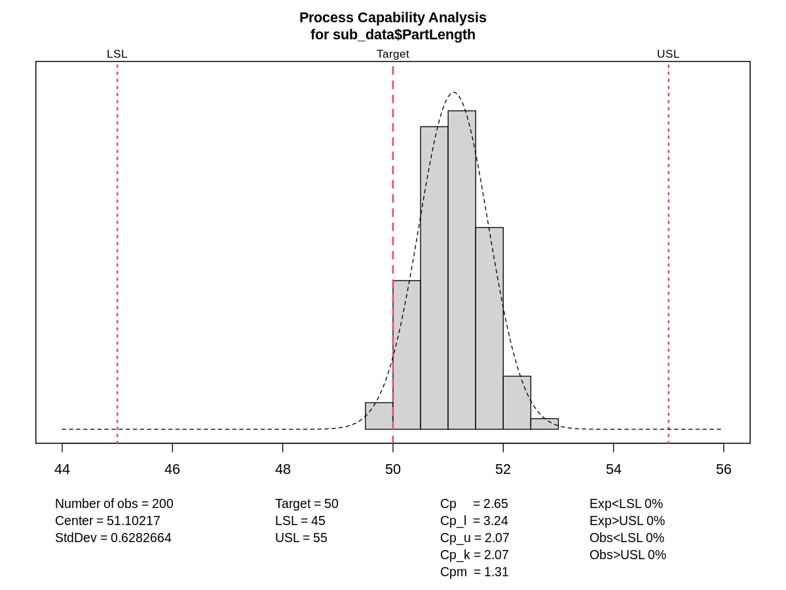
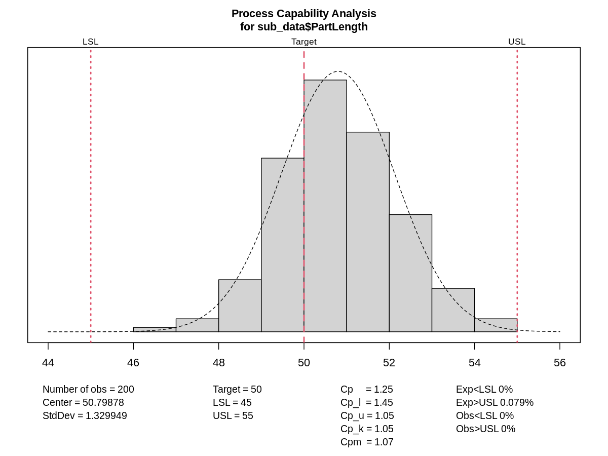
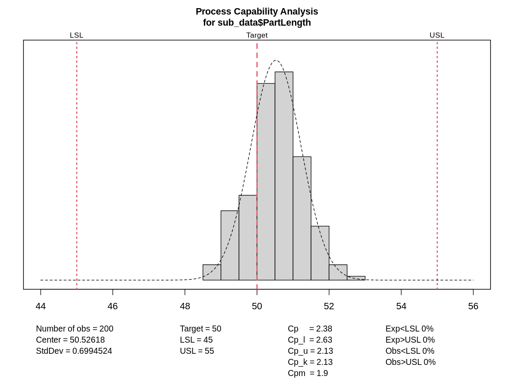

:::: {.columns}
::: {.column width="50%"}

## Sample slides
#### PlaceHolderName
#### Universiti Malaysia Perlis
#### [placeholder@email.com](mailto:placeholder@email.com)

<!-- __AUDIO_INTRO_DO_NOT_TOUCH__ -->

:::

::: {.column width="50%"}

:::

::::

---

:::: {.columns}
::: {.column width="50%"}
### Slide one
**Key Concepts:**
- Energy conservation per @carnot1824.
- $\Delta U = Q - W$
:::

::: {.column width="50%"}

:::
::::

---

---

:::: {.columns}
::: {.column width="50%"}
### The Master Equation
The fundamental relation of thermodynamics:

$$\Delta U = Q - W$$

The work done $W$ is positive when the system expands against an external pressure.
:::

::: {.column width="50%"}
<video data-src="media/videos/sample.mp4" data-autoplay loop muted width="100%"></video>
:::

::::

---

:::: {.columns}
::: {.column width="50%"}
### Visualizing the Gas Law
**Interactive Model:**

- P, V, and T relationships.
- Use the slider to adjust pressure.
- Observe the phase boundary.
:::

::: {.column width="50%"}
<iframe 
  data-src="media/plots/sample.html" 
  width="100%" 
  height="500px" 
  style="border:none;" 
  scrolling="no">
</iframe>
:::
::::

# Machine 1 Capability

::: columns
::: {.column width="40%"}
### Analysis
- **Pressure**: 200kPa
- **Temperature**: 338K
- **Assessment**: Evaluation of Machine 1's ability to maintain Part Length within [45, 55].
- Cp and Cpk values provide a measure of precision and centering.
:::

::: {.column width="60%"}
<iframe data-src='media/plots/m1_capability.html' width='100%' height='500px' style='border:none;'></iframe>
:::
:::

# Machine 2 Capability

::: columns
::: {.column width="40%"}
### Analysis
- **Pressure**: 200kPa
- **Temperature**: 338K
- **Assessment**: Statistical control check for Machine 2 under high stress conditions.
:::

::: {.column width="60%"}
<iframe data-src='media/plots/m2_capability.html' width='100%' height='500px' style='border:none;'></iframe>
:::
:::

# Machine 3 Capability

::: columns
::: {.column width="40%"}
### Analysis
- **Pressure**: 200kPa
- **Temperature**: 338K
- **Assessment**: Final machine capability comparison.
:::

::: {.column width="60%"}
<iframe data-src='media/plots/m3_capability.html' width='100%' height='500px' style='border:none;'></iframe>
:::
:::

# Machine 1 Capability Analysis

::: columns
::: {.column width="40%"}
### Process Assessment
- **Target**: 50.0000
- **Limits**: [45.0000, 55.0000]
- **Result**: Machine 1 demonstrates high precision but is slightly offset from the target mean.
:::

::: {.column width="60%"}

:::
:::

# Machine 2 Capability Analysis

::: columns
::: {.column width="40%"}
### Process Assessment
- **Status**: Marginal Capability
- **Observation**: Wider distribution compared to Machine 1, indicating higher variability under these conditions.
:::

::: {.column width="60%"}

:::
:::

# Machine 3 Capability Analysis

::: columns
::: {.column width="40%"}
### Process Assessment
- **Status**: Excellent
- **Observation**: Best combination of centering and narrow spread among the three machines.
:::

::: {.column width="60%"}

:::
:::

# Machine 1 Capability Analysis

::: columns
::: {.column width="40%"}
### Process Assessment
- **Target**: 50.0000
- **Limits**: [45.0000, 55.0000]
- **Result**: Machine 1 demonstrates high precision but is slightly offset from the target mean.
:::

::: {.column width="60%"}

:::
:::

# Machine 2 Capability Analysis

::: columns
::: {.column width="40%"}
### Process Assessment
- **Status**: Marginal Capability
- **Observation**: Wider distribution compared to Machine 1, indicating higher variability under these conditions.
:::

::: {.column width="60%"}

:::
:::

# Machine 3 Capability Analysis

::: columns
::: {.column width="40%"}
### Process Assessment
- **Status**: Excellent
- **Observation**: Best combination of centering and narrow spread among the three machines.
:::

::: {.column width="60%"}

:::
:::

# Machine 1 Capability Analysis

::: columns
::: {.column width="40%" style="display: flex; flex-direction: column; justify-content: center; text-align: center;"}
### Process Assessment

**Target**: 50.0000  
**Limits**: [45.0000, 55.0000]

Machine 1 demonstrates high precision but is slightly offset from the target mean.
:::

::: {.column width="60%" style="display: flex; align-items: center; justify-content: center;"}
{width=95%}
:::
:::

# Machine 2 Capability Analysis

::: columns
::: {.column width="40%" style="display: flex; flex-direction: column; justify-content: center; text-align: center;"}
### Process Assessment

**Status**: Marginal Capability

Observation: Higher variability noted under these specific conditions.
:::

::: {.column width="60%" style="display: flex; align-items: center; justify-content: center;"}
{width=95%}
:::
:::

# Machine 3 Capability Analysis

::: columns
::: {.column width="40%" style="display: flex; flex-direction: column; justify-content: center; text-align: center;"}
### Process Assessment

**Status**: Excellent

Observation: Best combination of centering and narrow spread.
:::

::: {.column width="60%" style="display: flex; align-items: center; justify-content: center;"}
{width=95%}
:::
:::

# Machine 1 Capability Analysis

::: columns
::: {.column width="40%" style="display: flex; flex-direction: column; justify-content: center; text-align: center;"}
### Process Assessment

**Target**: 50.0000  
**Limits**: [45.0000, 55.0000]

Machine 1 demonstrates high precision but is slightly offset from the target mean.
:::

::: {.column width="60%" style="display: flex; align-items: center; justify-content: center;"}
{width=95%}
:::
:::

# Machine 2 Capability Analysis

::: columns
::: {.column width="40%" style="display: flex; flex-direction: column; justify-content: center; text-align: center;"}
### Process Assessment

**Status**: Marginal Capability

Observation: Higher variability noted under these specific conditions.
:::

::: {.column width="60%" style="display: flex; align-items: center; justify-content: center;"}
{width=95%}
:::
:::

# Machine 3 Capability Analysis

::: columns
::: {.column width="40%" style="display: flex; flex-direction: column; justify-content: center; text-align: center;"}
### Process Assessment

**Status**: Excellent

Observation: Best combination of centering and narrow spread.
:::

::: {.column width="60%" style="display: flex; align-items: center; justify-content: center;"}
{width=95%}
:::
:::

# Machine 1 Assessment

::: columns
::: {.column width="30%" style="display: flex; flex-direction: column; justify-content: center;"}
### Capability Indices
- **$C_p$**: 2.6530
- **$C_{pk}$**: 2.0680

Machine 1 is highly precise but slightly off-center ($51.1$).
:::

::: {.column width="70%"}
{width=100%}
:::
:::

# Machine 2 Assessment

::: columns
::: {.column width="30%" style="display: flex; flex-direction: column; justify-content: center;"}
### Capability Indices
- **$C_p$**: 1.2530
- **$C_{pk}$**: 1.0530

Machine 2 shows higher variability and is near the limit.
:::

::: {.column width="70%"}
{width=100%}
:::
:::

# Machine 3 Assessment

::: columns
::: {.column width="30%" style="display: flex; flex-direction: column; justify-content: center;"}
### Capability Indices
- **$C_p$**: 2.3830
- **$C_{pk}$**: 2.1320

Machine 3 is the top performer with the best centering.
:::

::: {.column width="70%"}
{width=100%}
:::
:::
